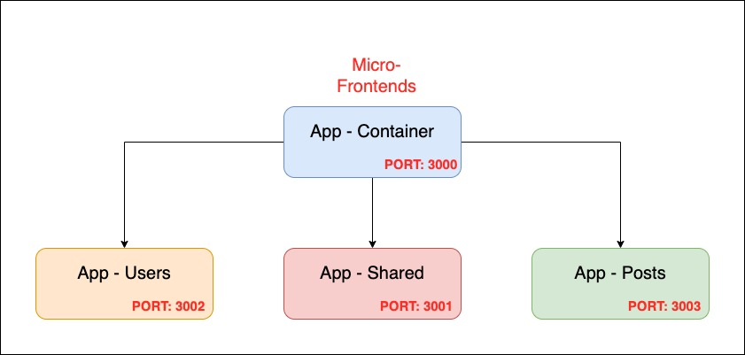
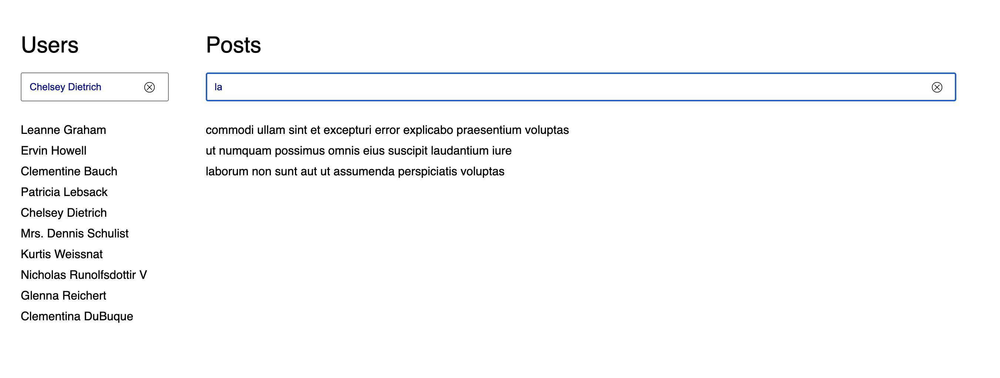

# POC Micro-frontends 

### Author: TRUONG THANH TAI - truthtaicom@gmail.com

### Stacks
- [x] React JS
- [x] TypeScript
- [x] Jotai ( Atomic - State Management )
- [x] Fela ( Atomic CSS )
- [x] Micro-frontends ( with Webpack's ModuleFederationPlugin )
- [x] Mono-Repo ( yarn workspace )
- [x] Docker

### Architecture


### How to install

```
yarn install
```

### Demo


### How to run

**Development mode**

```
yarn start
```

**Docker mode**

```
docker-compose up
```

### URLs:

- Main App ( Container ): https://localhost:3000

### Todos
- [ ] Types reference of micro-packages
